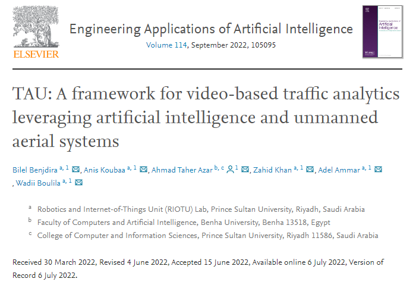
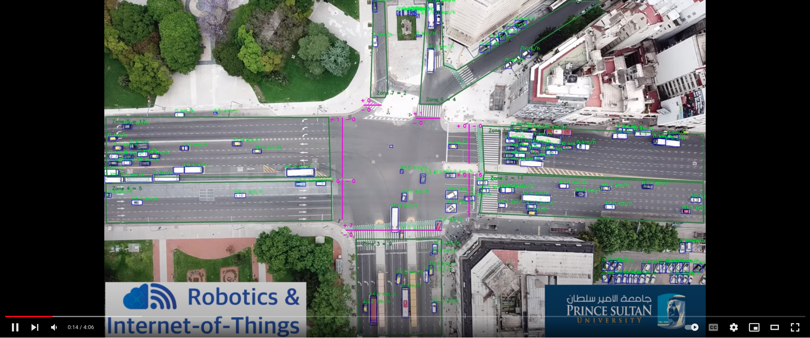
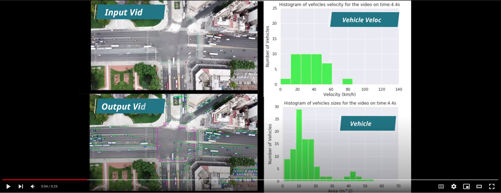

# TAU: A framework for video-based traffic analytics leveraging artificial intelligence and unmanned aerial systems 
Bilel Benjdira, Anis Koubaa, Ahmad Taher Azar, Zahid Khan, Adel Ammar, Wadii Boulila
RIOTU Lab, Prince Sultan University, Saudi Arabia

Link to the paper: https://www.sciencedirect.com/science/article/abs/pii/S0952197622002408 
[](https://www.sciencedirect.com/science/article/abs/pii/S0952197622002408)


# Citation
if you find our paper useful in your research, please cite:
```
@article{BENJDIRA2022105095,
title = {TAU: A framework for video-based traffic analytics leveraging artificial intelligence and unmanned aerial systems},
journal = {Engineering Applications of Artificial Intelligence},
volume = {114},
pages = {105095},
year = {2022},
issn = {0952-1976},
doi = {https://doi.org/10.1016/j.engappai.2022.105095},
url = {https://www.sciencedirect.com/science/article/pii/S0952197622002408},
author = {Bilel Benjdira and Anis Koubaa and Ahmad Taher Azar and Zahid Khan and Adel Ammar and Wadii Boulila}}
```


# Code description
We shared the source code for extracting 20 traffic insights using TAU. You can apply it on any UAV traffic video you want after generating the results.xslx file related to it. 

At this stage, we did not share the code we used to process the UAV traffic video and generate the results.xlsx file.

For any enquiry, please contact bilel.benjdira_at_gmail.com and riotu_at_psu.edu.sa. 

# Video demonstration
TAU Video Demonstration Link: https://youtu.be/wXJV0H7LviU

[](https://youtu.be/wXJV0H7LviU)

Video of the extracted histograms: https://www.youtube.com/watch?v=kGv0gmtVEbI 

[]([https://youtu.be/wXJV0H7LviU](https://www.youtube.com/watch?v=kGv0gmtVEbI))

# Samples of extracted insights

<p align="center">

</p>

<p align="center">

</p>


<p align="center">

</p>

<p align="center">

</p>

<p align="center">

</p>

<p align="center">

</p>

<p align="center">

</p>

<p align="center">

</p>

<p align="center">

</p>


<p align="center">

</p>

# The full trajectories follown by all the vehicles
<p align="center">

</p>


# Smart crossroads management of roads based on TAU

<p align="center">

</p>


# The correlation between the different factors to understand traffic law compliance 
<p align="center">

</p>

<p align="center">

</p>

<p align="center">

</p>
