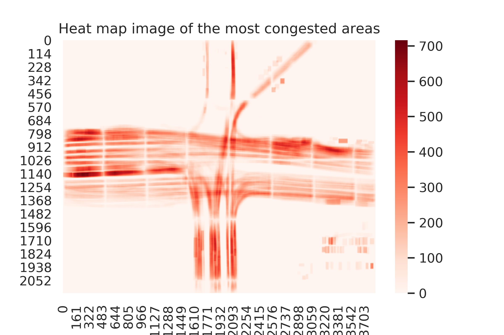

# TAU
TAU: A framework for video-based traffic analytics leveraging artificial intelligence and unmanned aerial systems

Bilel Benjdira, Anis Koubaa, Ahmad Taher Azar, Zahid Khan, Adel Ammar, Wadii Boulila

RIOTU Lab, Prince Sultan University, Saudi Arabia

# Code description
We shared the source code for extracting 20 traffic insights using TAU. You can apply it on any UAV traffic video you want after generating the results.xslx file related to it. 

At this stage, we did not share the code we used to process the UAV traffic video and generate the results.xlsx file.

The code and the framework can be used only for non-commercial purposes. For commercial interest please contact bilel.benjdira_at_gmail.com and riotu_at_psu.edu.sa

# Video demonstration
TAU Video Demonstration Link: https://youtu.be/wXJV0H7LviU

Video of the extracted histograms: https://www.youtube.com/watch?v=kGv0gmtVEbI 

)

# Samples of extracted insights

[]

[]

[]

[]

[]

[]

[]

[]

[]

[]

[]

[]

[]

